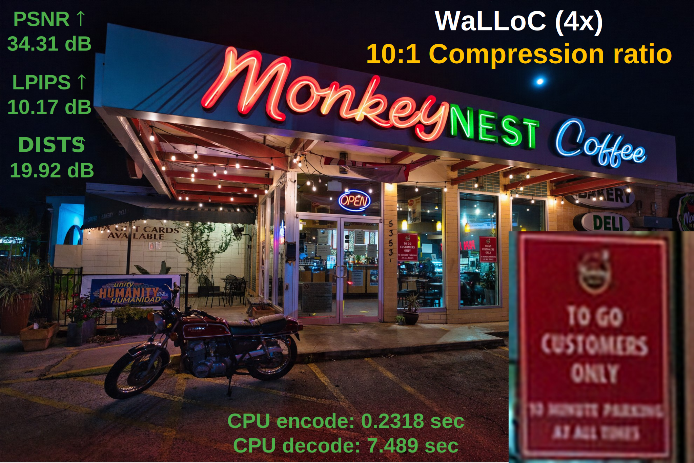

# Wavelet Learned Lossy Compression

- [WaLLoC repository](https://github.com/danjacobellis/walloc/)
- [Paper: "Learned Compression for Compressed Learning"](https://danjacobellis.net/_static/walloc.pdf)
- [Additional code accompanying the paper](https://github.com/danjacobellis/lccl)
- [Pre-trained codecs available on Hugging Face](https://huggingface.co/danjacobellis/walloc)

WaLLoC (Wavelet-Domain Learned Lossy Compression) is an architecture for learned compression that simultaneously satisfies three key
requirements of compressed-domain learning:

1. **Computationally efficient encoding** to reduce overhead in compressed-domain learning and support resource constrained mobile and remote sensors. WaLLoC uses a wavelet packet transform to expose signal redundancies prior to autoencoding. This allows us to replace the encoding DNN with a single linear layer (<100k parameters) without significant loss in quality. WaLLoC incurs <5% of the encoding cost compared to other neural codecs.

2. **High compression ratio** for storage and transmission efficiency. Lossy codecs typically achieve high compression with a combination of quantization and entropy coding. However, naive quantization of autoencoder latents leads to unpredictable and unbounded distortion. Instead, we apply additive noise during training as an
entropy bottleneck, leading to quantization-resiliant latents. When combined with entropy coding, this provides nearly 12× higher compression ratio compared to the VAE used in Stable Diffusion 3, despite offering a higher degree of dimensionality reduction and similar quality.

3. **Dimensionality reduction** to accelerate compressed-domain modeling. WaLLoC’s encoder projects high-dimensional signal patches to low-dimensional latent representations, providing a reduction of up to 20×. This allows WaLLoC to be used as a drop-in replacement for resolution reduction while providing superior detail preservation and downstream accuracy.

WaLLoC does not require perceptual or adversarial losses to represent high-frequency detail, making it compatible with a wide variety of signal types. It currently supports 1D and 2D signals, including mono, stereo, and multi-channel audio and grayscale, RGB, and hyperspectral images.


```{figure} img/radar.svg
---
name: radar
---
Comparison of WaLLoC with other autoencoder designs for RGB Images and stereo audio.

```

```{figure} img/wpt.svg
---
name: walloc
---
Example of forward and inverse WPT with $J=2$ levels. Each level applies filters $\text{L}_{\text{A}}$ and $\text{H}_{\text{A}}$ independently to each of the signal channels, followed by downsampling by two $(\downarrow 2)$. An inverse level consists of upsampling $(\uparrow 2)$ followed by $\text{L}_{\text{S}}$
and $\text{H}_{\text{S}}$, then summing the two channels. The full WPT $\tilde{\textbf{X}}$ of consists of $J$ levels.

```

```{figure} img/walloc.svg
---
name: walloc
---
WaLLoC’s encode-decode pipeline. The entropy bottleneck and entropy coding steps are only required to achieve high compression ratios for storage and transmission. For compressed-domain learning where dimensionality reduction is the primary goal, these steps can be skipped to reduce overhead and completely eliminate CPU-GPU transfers.

```





```{figure} img/walloc_16x.svg
---
name: walloc_16x
---
RGB image reconstruction compared to stable diffusion.

```


```{figure} img/stable_audio_comparison.svg
---
name: stable_audio_comparison
---
Stereo reconstruction performance compared to stable audio.

```


```
@article{jacobellis2024learned,
  title={Learned Compression for Compressed Learning},
  author={Jacobellis, Dan and Yadwadkar, Neeraja J.},
  year={2024},
  note={Under review},
  url={http://danjacobellis.net/walloc}
}
```